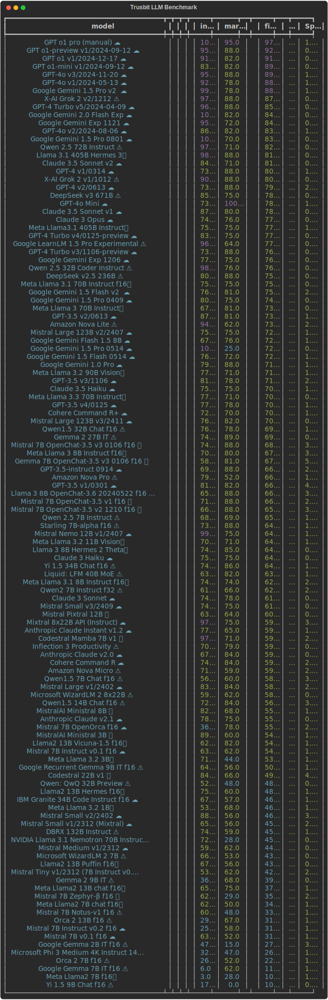

The monthly LLM Leaderboards help to find the best Large Language Model for digital product development. 

Read more at [Trustbit.tech](https://www.trustbit.tech/en/llm-benchmarks)

This repository tracks monthly history of benchmarks as [HTML](bench.html), [CSV](bench.csv), [SVG](bench.svg) and [MD](bench.md)

